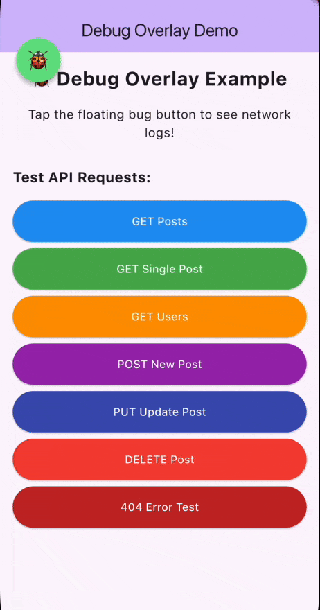

# 🐞 QA Debug Overlay

A professional debug overlay for Flutter apps — view network logs, inspect JSON, and debug effortlessly.


## 🎬 Demo



*Demo showing the debug overlay in action on iOS simulator*

## ✨ Features

- **🐞 Draggable Debug Button** - Tap to view logs
- **📊 Network Logging** - Automatic request/response capture
- **🔍 JSON Viewer** - Collapsible tree view
- **🪶 Super Lightweight** - Flexible dependencies, no version conflicts
- **🚀 Zero Configuration** - No initialization needed!
- **✅ No Conflicts** - Works with any project setup

## 📦 Installation

```yaml
dependencies:
  qa_debug_overlay: ^1.0.0
  # Latest stable versions:
  dio: ^5.9.0
  http: ^1.5.0
```

## 🚀 Quick Start

### 1. Wrap Your App (2 lines of code!)

```dart
MaterialApp(
  builder: (context, child) {
    return DebugOverlayWrapper(child: child!);
  },
);
```

### 2. Add Interceptor (if using Dio)

```dart
final dio = Dio();
dio.interceptors.add(DebugInterceptor());
```

**That's it!** The 🐞 button will appear. Tap it to view logs.

## 🌐 Supported HTTP Clients

The debug overlay works with **multiple HTTP clients**, not just Dio:

### 1. **Dio** (Recommended - Automatic Logging)
```dart
final dio = Dio();
dio.interceptors.add(DebugInterceptor()); // Automatic logging
await dio.get('https://api.example.com');
```

### 2. **HTTP Package** (Manual Logging)
```dart
import 'package:qa_debug_overlay/qa_debug_overlay.dart';

// Use wrapper methods for automatic logging
final response = await TestHttpLogger.getWithLogging('https://api.example.com');
final response = await TestHttpLogger.postWithLogging('https://api.example.com', data: data);
```

### 3. **Firebase** (Manual Logging)
```dart
// Firebase Functions
final result = await FirebaseLogger.logCall(
  name: 'getUserData',
  call: () => FirebaseFunctions.instance.httpsCallable('getUserData').call(params),
  params: params,
);

// Firestore
final doc = await FirebaseLogger.logRead(
  collection: 'users',
  docId: 'user123',
  read: () => FirebaseFirestore.instance.collection('users').doc('user123').get(),
);
```

### 4. **Any HTTP Client** (Manual Logging)
```dart
// Log any request manually
DebugOverlayController.instance.addLog(
  NetworkLog.create(
    method: 'GET',
    endpoint: '/api/users',
    statusCode: 200,
    requestBody: requestData,
    responseBody: responseData,
  ),
);
```

---

## 📖 Complete Example

```dart
import 'package:flutter/material.dart';
import 'package:dio/dio.dart';
import 'package:qa_debug_overlay/qa_debug_overlay.dart';

void main() {
  runApp(const MyApp());
}

class MyApp extends StatelessWidget {
  const MyApp({super.key});

  @override
  Widget build(BuildContext context) {
    return MaterialApp(
      title: 'My App',
      // Just wrap with builder - no init needed!
      builder: (context, child) {
        return DebugOverlayWrapper(child: child!);
      },
      home: const HomePage(),
    );
  }
}

class HomePage extends StatefulWidget {
  const HomePage({super.key});

  @override
  State<HomePage> createState() => _HomePageState();
}

class _HomePageState extends State<HomePage> {
  late final Dio dio;

  @override
  void initState() {
    super.initState();
    dio = Dio();
    dio.interceptors.add(DebugInterceptor()); // Add interceptor
  }

  @override
  Widget build(BuildContext context) {
    return Scaffold(
      appBar: AppBar(title: const Text('Home')),
      body: Center(
        child: ElevatedButton(
          onPressed: () async {
            await dio.get('https://jsonplaceholder.typicode.com/users');
          },
          child: const Text('Make API Call'),
        ),
      ),
    );
  }
}
```

---

## 🎯 Features

### Draggable Button
- Drag anywhere on screen
- Always on top
- Tap to open logs

### Network Logs
- Method (GET, POST, PUT, DELETE)
- Status code (color-coded)
- Endpoint URL
- Timestamp ("5s ago")
- Duration (ms)

### Log Details
- Full request/response
- JSON tree viewer
- Headers
- Copy to clipboard

### Filtering
- By endpoint (text search)
- By status code (200, 404, etc.)
- Clear filters button

---

## 🔧 Advanced Usage

### Programmatic Control

```dart
// Access controller
final controller = DebugOverlayController.instance;

// Show/hide overlay
controller.setOverlayVisible(true);

// Show/hide bottom sheet
controller.showBottomSheet();
controller.hideBottomSheet();

// Add manual log
controller.addLog(NetworkLog.create(
  method: 'GET',
  endpoint: '/api/test',
  statusCode: 200,
));

// Clear logs
controller.clearLogs();

// Set filters
controller.setFilters(endpoint: 'users', statusCode: 200);
controller.clearFilters();

// Listen to changes
controller.addListener(() {
  print('Logs updated: ${controller.logs.length}');
});
```

### Conditional Usage (Debug Only)

```dart
import 'package:flutter/foundation.dart';

MaterialApp(
  builder: (context, child) {
    // Only show in debug mode
    if (kDebugMode) {
      return DebugOverlayWrapper(child: child!);
    }
    return child!;
  },
);
```

---

## 🆚 Why v1.0.0?

### Before (v0.x)
```yaml
dependencies:
  flutter_bloc: ^9.1.1  # ❌ Conflicts
  get_it: ^8.2.0        # ❌ Conflicts
  equatable: ^2.0.5     # ❌ Unnecessary
```

❌ 2500+ lines of code  
❌ BLoC architecture  
❌ Complex DI setup  
❌ Conflicts with user's BLoC/DI  

### After (v1.0.0)
```yaml
dependencies:
  dio: ^5.4.0           # ✅ Already in your project
  flutter_json_view: ^1.1.3  # ✅ Lightweight
```

✅ 800 lines of code  
✅ Simple ChangeNotifier  
✅ No initialization  
✅ **No conflicts!**

---

## 📊 What's Inside

```
lib/
├── controller/
│   └── debug_overlay_controller.dart  # Simple ChangeNotifier
├── interceptor/
│   └── debug_interceptor.dart         # Dio interceptor
└── widgets/
    ├── debug_overlay_wrapper.dart     # Main wrapper
    ├── draggable_debug_button.dart    # Floating button
    ├── debug_logs_bottom_sheet.dart   # Bottom sheet UI
    └── log_detail_view.dart           # Detail page
```

---

## 🐛 Troubleshooting

### Bug button doesn't appear?

Check:
1. ✅ Wrapped with `DebugOverlayWrapper`
2. ✅ Used in `builder` parameter
3. ✅ Did Hot Restart (not just hot reload)

### Logs are empty?

Check:
1. ✅ Added `DebugInterceptor()` to Dio
2. ✅ Made an API call
3. ✅ Tapped the 🐞 button

### Using without Dio?

You can manually add logs:

```dart
DebugOverlayController.instance.addLog(
  NetworkLog.create(
    method: 'GET',
    endpoint: '/api/test',
    statusCode: 200,
    requestBody: {'key': 'value'},
    responseBody: {'result': 'success'},
  ),
);
```

---

## 🤝 Contributing

Contributions welcome! This is now a simple, maintainable codebase.

---

## 📝 License

MIT License - see [LICENSE](LICENSE) file.

---

## 🙏 Credits

Built with ❤️ for Flutter developers

**Made Simple. No BLoC. No Drama.** 😎
